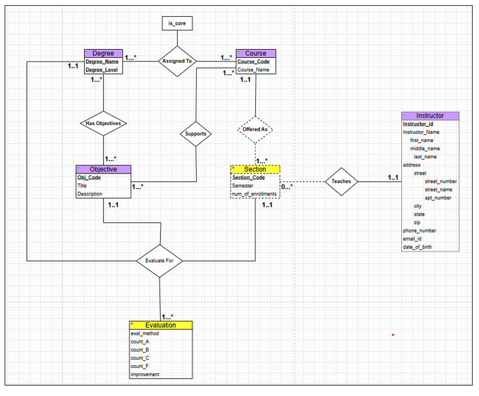

# Program Evaluation Database System

## 🚀 Overview
This project is a comprehensive database solution designed to manage and evaluate academic degree programs. It enables university departments to track learning objectives, course sections, and instructor evaluations through a structured relational backend.

**Key Technical Highlight:
* Relational Schema Design: Engineered an 11-table schema to handle complex **"diamond" relationships** between Degrees, Courses, and Objectives.

* Soft Delete Strategy: 
   1. The Problem with Standard Deletion ("Hard Delete"): In a university context, permanently deleting records creates data integrity issues. For example, if a professor retires and their record is deleted, all        historical reports for courses they taught in previous years would break or show missing data. 
   2. The Solution: "Soft Delete" (Archiving) We implemented a Soft Delete strategy using a status column. 
      • Mechanism: Major tables (Instructor, Course, Degree) include a status column defaulting to 'Active'. 
      • Archiving: Clicking "Archive" runs an UPDATE command (setting status to 'Inactive') rather than a DELETE command. 
      • Benefits: 
         o Data Preservation: Historical reports remain accurate. 
         o User Interface: Dropdown menus filter out Inactive records for future assignments but allow them for historical data entry. 
         o Restoration: Records can be reactivated if needed.
* Automated DDL Pipeline: Created a Python automation script that programmatically builds the entire relational structure, ensuring consistent deployment across environments.
* Data Integrity Validation: Developed server-side logic to ensure grade distributions (A, B, C, F) precisely match official enrollment figures.

## 🎨 ER Diagram

### 1. Core Administrative Entities
These tables store the fundamental data for the university. They utilize a **Soft Delete** strategy to preserve historical integrity for reporting.

| Table | Primary Key | Description |
| :--- | :--- | :--- |
| **Degree** | `(name, level)` | Tracks programs (e.g., BS in Computer Science). |
| **Course** | `course_code` | Catalog of all departmental courses. |
| **Instructor** | `instructor_id` | Profile information for faculty members. |

### 📅 2. Scheduling & Assignments
These tables manage the operational side of the university: tracking when courses are offered and which faculty members are responsible for them.

* **Section**: Records specific course offerings for a term (e.g., Section 001 of CS5330 in Fall 2024).
* **Teaches**: A relationship table that links **Instructors** to their assigned **Sections**.

### 💎 3. The "Diamond" Mapping Logic
This represents the most sophisticated part of the schema, allowing for **contextual mapping** between programs, requirements, and goals.

* **Objective**: Defines specific learning outcomes (e.g., "SQL Mastery" or "Statistical Inference").
* **Degree_Course**: Defines whether a specific course is a **Core** requirement or an **Elective** for a specific degree.
* **Degree_Objective**: Assigns specific learning goals to specific programs.
* **Course_Objective (The Diamond Link)**: This table maps a **Course** to an **Objective** specifically *within* a **Degree** context. 
    * **Why this matters:** This allows a single course to satisfy "Objective A" for a Computer Science Degree, but "Objective B" for a Data Science Degree.

### 📊 4. Evaluation & Reporting
These tables capture the final outputs of the system—the academic data and feedback collected at the conclusion of each term.

* **Evaluation**: Stores aggregated student performance data. Instead of individual student records, it stores the total count of students achieving grades **A, B, C, or F**, along with instructor improvement notes.
* **Evaluation_Method**: A flexible table that allows instructors to list multiple assessment types (e.g., "Midterm" AND "Group Project") used to measure a single objective.

## 🛠️ Tech Stack

* Database: MySQL / MariaDB.
* Backend: Python 3.x.
* Web Framework: Flask.
* Interface: Browser-based GUI.

## ⚙️ Installation & Setup

1. Prerequisites 
Before setting up the project, ensure your computer has the following installed: 
* MySQL Server: The database engine where data will be stored. (Download the "MySQL Community Server" version). 
* Python 3.x: The programming language used for the application. 
* MySQL Workbench: (Optional) A visual tool to verify your database exists. 

2. Installation Steps 
   Step A: Create the Database Shell 
      1. Open MySQL Workbench (or your command line interface). 
      2. Connect to your local MySQL instance. 
      3. Open a new query tab and run this single command to create the empty container for 
         our system: 
         CREATE DATABASE program_eval; 
         Note: You do not need to create tables manually. We have a Python automation script for that.
         
   Step B: Configure the Project 
      1. Open the project folder called GradGroup20_Project. 
      2. Locate the file named config.ini in the root folder. 
      3. Open it with a text editor (Notepad, VS Code) and update the settings to match your 
         MySQL credentials: 
         [mysql] 
         host = localhost 
         user = root <-- Your MySQL username (usually 'root') 
         password = yourpassword <-- The password you created during MySQL installation 
         database = program_eval <-- The exact name you used in Step A
         
   Step C: Install Python Libraries 
      1. Open your terminal (Command Prompt or PowerShell). 
      2. Navigate to the project folder: 
      cd path/to/project_folder 
      3. Install the required connectors using pip: 
      pip install flask mysql-connector-python
   
   Step D: Initialize the Database (Automation) 
      1. This project uses a dedicated Python script to build the entire database schema 
      automatically. 
      2. In your terminal, run: 
      python Create_Tables.py 
      3. Success Check: Watch the terminal output. You should see the message: Tables 
      checked/created. 
         * What just happened? This script connected to your database and ran the CREATE 
         TABLE IF NOT EXISTS commands for all 11 tables (Degree, Course, Instructor, etc.) 
         defined in our schema.
   
   Step E: Launch the Application 
      1. Start the web server by running the main application file: 
      python app.py 
      2. You will see a confirmation message indicating the server is active (usually Running on 
      http://127.0.0.1:5000). 
      3. Open your web browser (Chrome, Firefox, etc.) and type that URL into the address bar to 
      access the system.

##  User Manual (How to Use) 
   (This section explains the workflow for the user once the app is running). 
   1. Data Entry (Setup Phase) 
      • Navigate to the Data Entry menu. 
      • Order of Operations: You must create "Parent" records before "Child" records. 
         1. Add Degree: Define the program (e.g., "Computer Science - MS"). 
         2. Add Instructor: Enter faculty details. 
         3. Add Course: Define courses and link them to a Degree (mark them as Core or Elective). 
         4. Add Section: Schedule a course for a specific semester. Note: Enrollment must be > 0 and no negative numbers. 
   
   2. Objectives & Mapping 
      • Go to Objectives & Mapping. 
      • First, create Learning Objectives (e.g., "SQL Mastery"). 
      • Then, use Map Course Objective to link a specific Course to an Objective for a specific Degree. This step is required before evaluations can be entered. 
  
   3. Entering Evaluations 
      • Go to Enter Evaluation. 
      • Select the context: Degree Semester Instructor. 
      • Click the section you wish to grade. 
      • Input Data: 
         o Select evaluation methods (e.g., "Quiz", "Lab Demo"). 
         o Enter the count of students who received A, B, C, or F. 
         o Validation Rule: The total count of grades must match the official Enrolment number exactly (or be 0 if saving partial progress). 
   
   4. Running Reports 
      • Report 2 (Passing Rates): Select a semester and a target percentage (e.g., 80%). The system will show all courses where the passing rate (A+B+C) meets that threshold. 
      • Report 5 (Status): Use this to audit which professors have completed their data entry. Look for the Green "Entered" badge vs. the Yellow "Partially Entered" badge.
   

## 🧠 Challenges & Engineering Solutions

---

### 1. The "Diamond" Mapping Conflict

**The Challenge**  
A standard many-to-many relationship between **Courses** and **Objectives** was insufficient.  
We identified a critical issue where a course could fulfill **Objective A** for a *Computer Science* degree but **Objective B** for an *Information Technology* degree.  
Using a simple join table would have caused **data leakage**, allowing objectives from one degree to incorrectly appear in another.

**The Solution**  
I engineered a **Context-Aware Mapping (Diamond Relationship)** by introducing a centralized `Course_Objective` table.  
This table enforces a **composite foreign key** relationship referencing both:
- `Degree_Course`
- `Degree_Objective`

This design ensures that objective mappings are valid **only within an approved degree context**.

**The Impact**  
- Instructors can evaluate courses **only against objectives explicitly sanctioned** for that degree
- Eliminated **100% of potential cross-degree data corruption**
- Ensured accuracy during **end-of-semester reporting**

---

### 2. Maintaining Referential Integrity During Archival

**The Challenge**  
When a **Degree** or **Instructor** is set to *Inactive* using a **Soft Delete**, standard SQL `ON DELETE CASCADE` rules do not apply.  
This created a risk where inactive instructors could still be mistakenly assigned to new sections because they technically remained in the database.

**The Solution**  
I implemented **Application-Level Validation** combined with **Filtered View Logic**.

- **Backend (Flask API):**  
  Performs a status check before any `INSERT` operation to ensure all related entities are **Active**.

- **Frontend (UI Layer):**  
  Uses dynamic SQL queries to:
  - Exclude **Inactive** records from *New Entry* forms
  - Retain **Inactive** records for *Historical Reports*

**The Impact**  
- Preserved a historically accurate **Golden Record** for university audits
- Prevented accidental use of archived entities
- Delivered a clean, error-proof experience for administrative users

---
